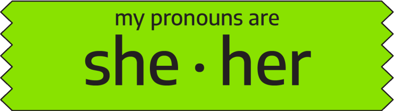
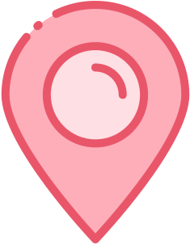

<h1 align="center">👋 Hi there, I'm Nishie!</h1>

<h3 align="center">
    
    
    
    
    Chicago
</h3>

<h3 align="center">
    A Full-Stack developer with a love for frontend development.
</h3>

---

    <h3>Experiences</h3>
        
    
     

 

## Hobbies :sunrise_over_mountains:

- Video Game Nerd :sunglasses:
- Homelab Tinkerer :wrench:
- Music Lover :musical_note:

## TV Shows :tv:

- Adventure Time :deciduous_tree:
- Dexter :microscope:
- Brooklyn Nine-Nine :police_car:

---

<h3 align="center">
    Looking for more info? Visit my portfolio.
    <h3 align="center">
        <a href="https://nishiegroe.com">&rarr; NishieGroe.com &larr;</a>
    </h3>
</h4>

<!--
**nishiegroe/nishiegroe** is a ✨ _special_ ✨ repository because its `README.md` (this file) appears on your GitHub profile.

Here are some ideas to get you started:

- 🔭 I’m currently working on ...
- 🌱 I’m currently learning ...
- 👯 I’m looking to collaborate on ...
- 🤔 I’m looking for help with ...
- 💬 Ask me about ...
- 📫 How to reach me: ...
- 😄 Pronouns: ...
- ⚡ Fun fact: ...
-->
